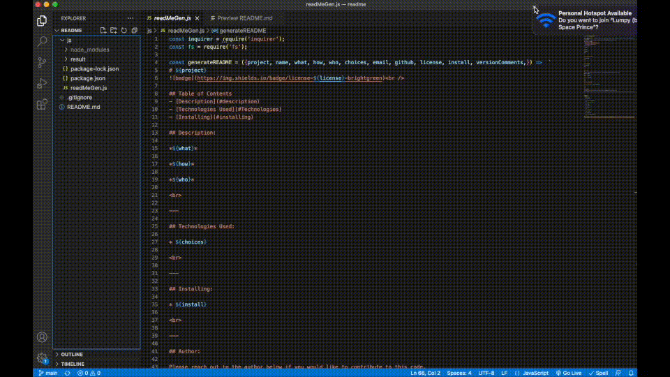

 
# Read Me Maker v1.0 
 

**Repository Link:** https://github.com/Brento20/readme

**Deployed Link:** N/A - no HTML deployed

 
 

---

## Table of Contents
- [Description](#description)
- [Technologies Used](#Technologies)
- [Installing](#installing)

 

## Description:

*This application aims to create consistency between read me files, creating a professional standard that developers can use thats quick and simple.*

*It works by asking specific questions that developers can answer to make sure they don't forget important information,*

*This was written with developers and project managers in mind.*

 

---

## Technologies Used:

* JavaScript

 

---

## Installing:

* Download and open in VS Code. Run "npm install" to install dependencies and run "node readMeGen.js" Please ensure you have Node.js installed.

 

---

## Using the command line/terminal 

## Author:

Please reach out to the author below if you would like to contribute to this code.

Name: Brenton Weaver

Email: brenton.weaver@gmail.com

Github: brento20

 

---

## Version History:

Version Comments: This is the first release of this code. Please contact the author to contribute.

 

---

## License:
 

* MIT

